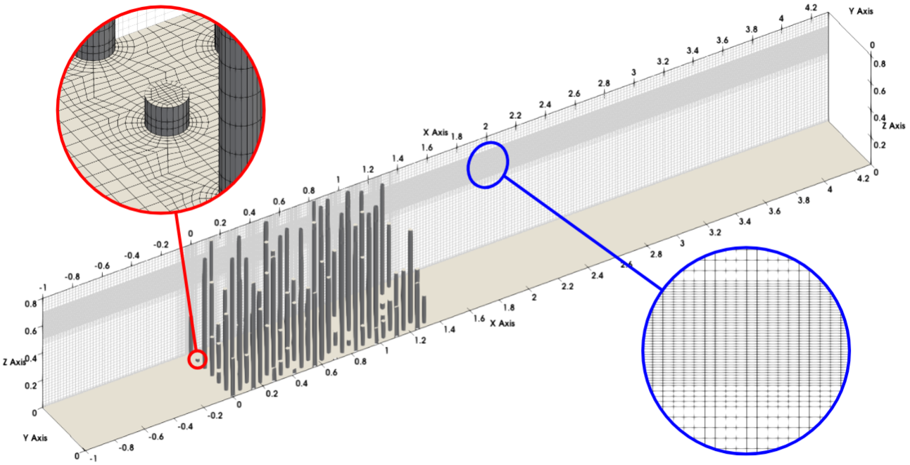

# Openfoam Inhomogeneous Mangrove Wave Attenuation 

This case simulates wave attenuation across inhomogeneous vegetation such as a mangrove forest (idealized as arrays of cylinders with height following an [exponential distribution](https://en.wikipedia.org/wiki/Exponential_distribution)). You may find more information on this work at https://arxiv.org/abs/2606.11653. The mesh is generated using a custom python library (the `blocktool.py` file in the `system` folder).  



Cite this work as
```
Pang, K.E., & Tay, Z.Y. (2026). On the Modelling of the Hydrodynamic Drag of Mangroves. URL: https://arxiv.org/abs/2606.11653.
```

## Prerequisite 
1. This case is tested with OpenFOAM v2412 (https://www.openfoam.com/).
2. Python is needed to generate the mesh files.
3. I am using a `Makefile` to run all the commands, but you can run the commands line by line if you don't want to use Make. 

## Instructions 
1. Generate the mesh files
```
make run-mesh
```
This calls the `getBlockMeshDict.py` to generate a `blockMeshDict` file and a `mySurface.stl` (which contains the cylinders). Then `blockMesh`, `refineMesh`, and `snappyHexMesh` is used to create the simulation mesh.  

2. Run the simulation

You may set the number of cores you wish to run the simulation with in the `Makefile`. Then start the simulations with 
```
make run-sim
```
